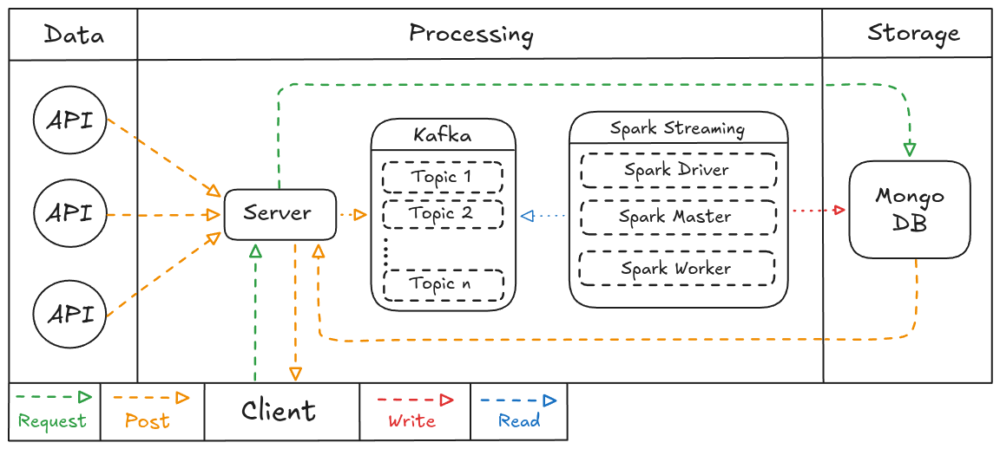
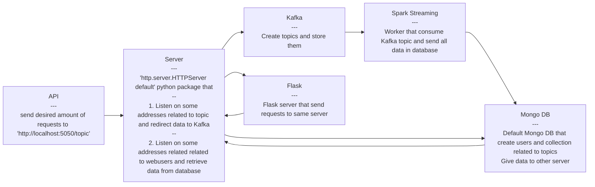

<h2>Content</h2>

- [Overview](#overview)
- [Architecture](#high-level)
    - [High level architecture](#high-level)
    - [Low level architecutre](#low-level)
- [Tech stack](#tools-used)
    - [Tools used](#tools-used)
- [How to run](#installation)
    - [Installation](#installation)
    - [Running](#running)
- [Why this tools being used](#tool-purpose)
- [How to use](#using)

<a name="overview"></a>
<h2>Overview</h2>

This project accept requests from users (API's), process them in micro-batches, store in NoSQL database and serve this data to website

<a name="goals"></a>
<h2>Project Goals</h2>

In this project i wanted to try micro-batch ingestions with [Apache Spark](https://github.com/apache/spark) particularly and representhing this data in some way that can be interactive. First i thought about saving data in [Apache Iceberg](https://github.com/apache/iceberg) or [Delta Lake](https://github.com/delta-io/delta) formats and adding some kind of catalog no top of that but, then i understood that this data would just stay in the catalog and thats all. But i wanted this data to be interactable and didn't want to do just boring charts that doesn't serve any purpose in solo project, than i thought about be able to show this data in website and be more simpler for all users to interact to then just sinking data to dashboards that mostly Data Analysts be interestide in <br>
But overall focus in this project was on understanding basic [Apache Spark Streaming](https://spark.apache.org/docs/latest/streaming-programming-guide.html) and what are the capabilities of this tool and how it interact with other services

<a name="preview"></a>
<h2>Website Preview</h2>

[/mqdefault.jpg))](https://youtu.be/fTuURojaeWA?si=QAXfz-ytSu1vS9WJ)

<a name="tools-used"></a>
<h2>Tools used</h2>

* [Apache Spark (Streaming)](https://spark.apache.org/docs/latest/streaming-programming-guide.html) - micro-batch streaming
* [MongoDB](https://github.com/mongodb/mongo) - NoSQL storage
* [Flask](https://github.com/pallets/flask/) - web-framework
* [Python](https://github.com/python/cpython) - glueing all pieces and writing logic
* [Docker](https://www.docker.com) - containerization

<a name="high-level"></a>
<h2>High Level Architecture</h2>



**API** - Source where data comes from in real-time

**Server** - Currently it have 2 different use cases, in production should be split it 2 different servers

1. Get data from API's and redirect them in Kafka
2. Catch requests from users, retrieve required data from storage and send back to client

**Kafka** - Store data for multiple services be able to consume

**Spark Streaming** - Process data from Kafka in micro batches and write it to persistent storage

**Mongo DB** - Persist all data in Document-Based storage

**Client** - Users that interact with website

<a name="low-level"></a>
<h2>Low Level Architecture</h2>



**API** - [script](./src/API.py) that [generate random data](./src/API.py#L92) with 'faker' library and send it with 'requests' library

There is also functionality to [send corrupt data](./src/API.py#L113-114) (wrong data type), 0-1 (float) percent data being corrupted on each request. Only 1 column in 1 request can be corrupt

**Server** - HTTPServer python package listen 2 different purpose addresses
1. ['/topics'](./docker/kafka-interceptor/interceptor.py#L35-53)  and [redirect data](./docker/kafka-interceptor/interceptor.py#L40) with 'confluent_kafka' python package
2. ['/users'](./docker/kafka-interceptor/interceptor.py#L56-69) (any user API requests)  [send request to MongoDB](./docker/kafka-interceptor/interceptor.py#L61) to retrieve data about all possible users, apply sorting and pagination if needed and send back to client

**Kafka** - Store data from API's in topics

**Spark Streaming** - From ['spark-driver'](./docker-compose.yaml#L136-169) [fire script](./docker-compose.yaml#L165) that: connect to MongoDB, start reading topic, transform it needed and send all data to MongoDB with some interval

**Mongo DB** - Create collections and users for other services to be able to connect with [init.js](./docker/mongodb/init.js)

**Flask** - Single [web page](./docker/flask/templates/index.html) that retrieve send requests to server and display this data

<a name="tool-purpose"></a>
<h2>Why this tools being used</h2>

**Apache Spark**

At the moment of creating this project i didn't really used any processing engines, if we not including just goofing around with the tools. This is most mainstream for batch and it seemed like most logical way of learning this tool.

And also i wanted to see what the difference between micro-batch and real-time for myself, but it isn't shown in this project there is [this](https://github.com/d1splay2/Steam-Reviews-Ingestion) project where i does real-time ingestions

**Mongo DB**

I wasn't focusing on learning NoSQL databases so i just choose most out of the box ready tool and it fit my needs


**Flask**

Same story here, writing HTML, CSS wasn't the goal of this project Flask was just tool that i used before and i didn't find any reasons why i wouldn't use it.

Most of the HTML code is written by AI i just tweaked logic a bit and added some things

<a name="installation"></a>
<h2>Installation</h2>

Clone repository

```shell
git clone https://github.com/d1splay2/Live-Website-Backend-Storage.git
```

<a name="running"></a>
<h2>Running</h2>

1. Move in directory with the project
```shell
cd path/to/project
```

2. And just run simple 'docker compose up' and all initializations will be done
```shell
docker compose up
```

There is might be problem when running for the first time with the MongoDB, it problem with how 'init.js' is getting loaded and as far as i understood its a problem on MongoDB end.
Just rerunning 'docker compose up' fixed it every time for me

**API's simulation**
1. Create virtual environment
```shell
python -m venv env
```
2. Activate environment
```shell
source env/bin/activate
```
3. Install dependencies
```shell
pip install -r requirements.txt
```
4. Run API simulation script
```shell
python src/API.py
```
> You can specify amount of requests send [here](./src/API.py#L160)
